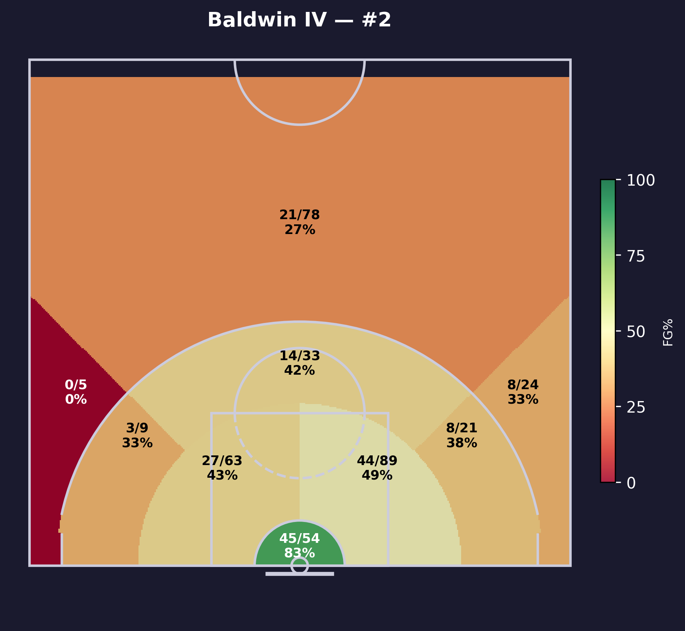
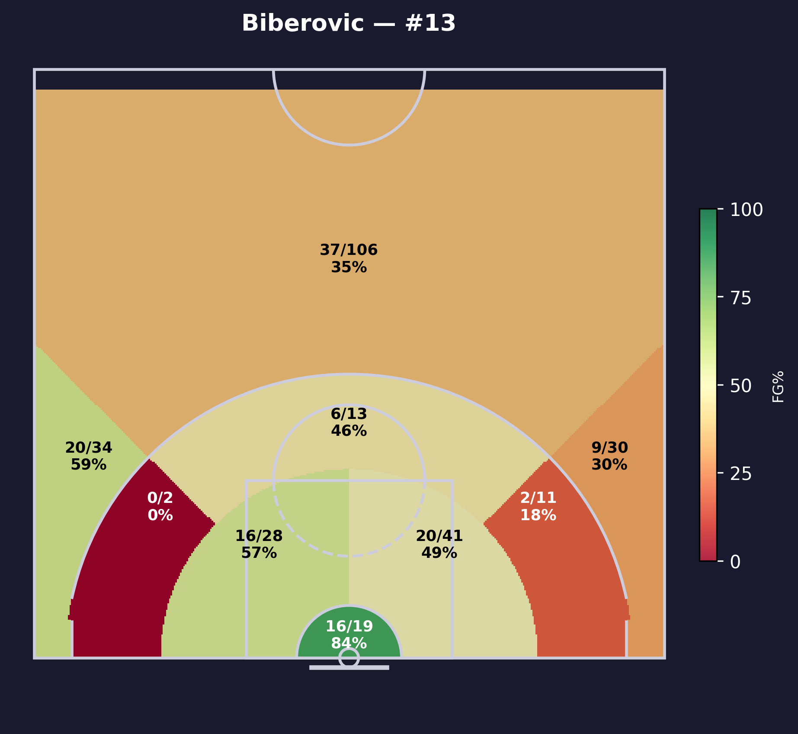
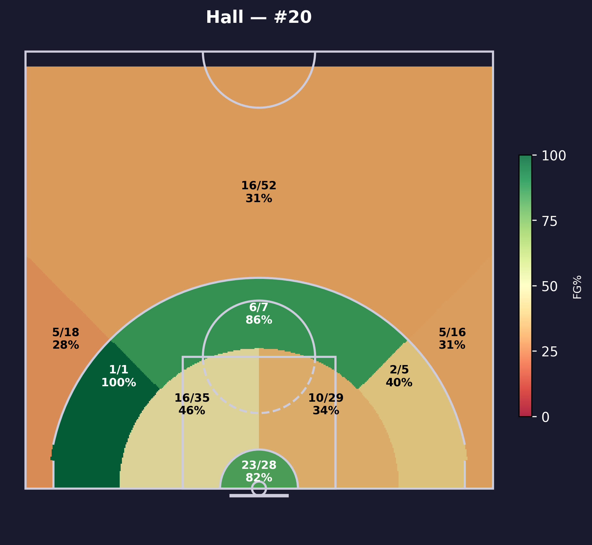

# B Roster & Player Profiles

## Full Roster
<!-- START_TABLE ROSTER -->
|   # | Name                | Pos   | Nationality   | Height   | Weight   |   Age |
|----:|:--------------------|:------|:--------------|:---------|:---------|------:|
|   0 | Armando Bacot Jr.   | C/F   | USA           | 6'10     | 240 lbs  |    25 |
|   1 | Metecan Birsen      | SF    | Turkey        | 6'7      | 210 lbs  |    25 |
|   2 | Wade Baldwin Iv     | PG    | USA           | 6'3      | 194 lbs  |    28 |
|   4 | Nicolo Melli        | PF    | Italy         | 6'9      | 220 lbs  |    35 |
|   5 | Brandon Boston Jr.  | SG    | USA           | 6'6      | 190 lbs  |    23 |
|   8 | Talen Horton Tucker | SG    | USA           | 6'4      | 230 lbs  |    24 |
|  12 | Nando De Colo       | SG    | France        | 6'4      | 196 lbs  |    38 |
|  13 | Tarik Biberovic     | SF    | Bosnia        | 6'8      | 205 lbs  |    22 |
|  14 | Melih Mahmutoglu    | PG    | Turkey        | 6'2      | 185 lbs  |    32 |
|  17 | Onuralp Bitim       | SF    | Turkey        | 6'6      | 210 lbs  |    25 |
|  18 | Mikael Jantunen     | SF    | Finland       | 6'7      | 220 lbs  |    25 |
|  20 | Devon Hall          | SG    | USA           | 6'5      | 200 lbs  |    29 |
|  25 | Chris Silva         | PF    | USA           | 6'8      | 235 lbs  |    29 |
|  30 | Jilson Bango        | C     | Angola        | 7'0      | 238 lbs  |    26 |
|  32 | Arturs Zagars       | PG    | Latvia        | 6'3      | 185 lbs  |    22 |
|  50 | Bonzie Colson       | PF    | USA           | 6'6      | 225 lbs  |    28 |
|  92 | Khem Birch          | C     | Canada        | 6'9git   | 233 lbs  |    32 |
<!-- END_TABLE ROSTER -->
---

## Key Player Profiles

<!-- START_TABLE PLAYER-1-HEADER -->
### Wade Baldwin Iv — #2
<!-- END_TABLE PLAYER-1-HEADER -->

<!-- START_TABLE PLAYER-1-IMAGE -->

<!-- END_TABLE PLAYER-1-IMAGE -->

<!-- START_TABLE PLAYER-1-STATS -->
| Stat     | Season Avg   | Last 5 Avg   |
|:---------|:-------------|:-------------|
| Points   | 14.4         | 13.6         |
| Rebounds | 3.2          | 2.2          |
| Assists  | 5.5          | 5.4          |
| FG%      | 45.8%        | 40.7%        |
| 3P%      | 27.7%        | 23.1%        |
| Minutes  | 26.0         | 27.3         |
<!-- END_TABLE PLAYER-1-STATS -->

!!! tip "Scouting Notes"
    _Describe strengths, tendencies, preferred spots, and how to defend this player._

<!-- START_TABLE PLAYER-1-HEATMAP -->

<!-- END_TABLE PLAYER-1-HEATMAP -->

---

<!-- START_TABLE PLAYER-2-HEADER -->
### Devon Hall — #20
<!-- END_TABLE PLAYER-2-HEADER -->

<!-- START_TABLE PLAYER-2-IMAGE -->

<!-- END_TABLE PLAYER-2-IMAGE -->

<!-- START_TABLE PLAYER-2-STATS -->
| Stat     | Season Avg   | Last 5 Avg   |
|:---------|:-------------|:-------------|
| Points   | 8.6          | 6.2          |
| Rebounds | 3.0          | 3.0          |
| Assists  | 2.7          | 2.2          |
| FG%      | 41.2%        | 37.9%        |
| 3P%      | 25.8%        | 21.4%        |
| Minutes  | 24.9         | 22.7         |
<!-- END_TABLE PLAYER-2-STATS -->

!!! tip "Scouting Notes"
    _Describe strengths, tendencies, preferred spots, and how to defend this player._

<!-- START_TABLE PLAYER-2-HEATMAP -->

<!-- END_TABLE PLAYER-2-HEATMAP -->

---

<!-- START_TABLE PLAYER-3-HEADER -->
### Tarik Biberovic — #13
<!-- END_TABLE PLAYER-3-HEADER -->

<!-- START_TABLE PLAYER-3-IMAGE -->

<!-- END_TABLE PLAYER-3-IMAGE -->

<!-- START_TABLE PLAYER-3-STATS -->
| Stat     | Season Avg   | Last 5 Avg   |
|:---------|:-------------|:-------------|
| Points   | 10.5         | 11.0         |
| Rebounds | 3.1          | 2.7          |
| Assists  | 1.3          | 1.3          |
| FG%      | 44.1%        | 50.0%        |
| 3P%      | 39.2%        | 60.0%        |
| Minutes  | 23.8         | 23.0         |
<!-- END_TABLE PLAYER-3-STATS -->

!!! tip "Scouting Notes"
    _Describe strengths, tendencies, preferred spots, and how to defend this player._

<!-- START_TABLE PLAYER-3-HEATMAP -->

<!-- END_TABLE PLAYER-3-HEATMAP -->

---

<!-- START_TABLE PLAYER-4-HEADER -->
### Talen Horton Tucker — #8
<!-- END_TABLE PLAYER-4-HEADER -->

<!-- START_TABLE PLAYER-4-IMAGE -->

<!-- END_TABLE PLAYER-4-IMAGE -->

<!-- START_TABLE PLAYER-4-STATS -->
| Stat     | Season Avg   | Last 5 Avg   |
|:---------|:-------------|:-------------|
| Points   | 15.7         | 12.4         |
| Rebounds | 3.8          | 4.0          |
| Assists  | 1.9          | 2.4          |
| FG%      | 48.5%        | 37.3%        |
| 3P%      | 29.0%        | 15.4%        |
| Minutes  | 23.7         | 25.3         |
<!-- END_TABLE PLAYER-4-STATS -->

!!! tip "Scouting Notes"
    _Describe strengths, tendencies, preferred spots, and how to defend this player._

<!-- START_TABLE PLAYER-4-HEATMAP -->

<!-- END_TABLE PLAYER-4-HEATMAP -->

---

<!-- START_TABLE PLAYER-5-HEADER -->
### Nicolo Melli — #4
<!-- END_TABLE PLAYER-5-HEADER -->

<!-- START_TABLE PLAYER-5-IMAGE -->

<!-- END_TABLE PLAYER-5-IMAGE -->

<!-- START_TABLE PLAYER-5-STATS -->
| Stat     | Season Avg   | Last 5 Avg   |
|:---------|:-------------|:-------------|
| Points   | 6.6          | 8.5          |
| Rebounds | 5.4          | 5.0          |
| Assists  | 1.6          | 2.5          |
| FG%      | 46.4%        | 50.0%        |
| 3P%      | 41.7%        | 37.5%        |
| Minutes  | 22.7         | 20.6         |
<!-- END_TABLE PLAYER-5-STATS -->

!!! tip "Scouting Notes"
    _Describe strengths, tendencies, preferred spots, and how to defend this player._

<!-- START_TABLE PLAYER-5-HEATMAP -->

<!-- END_TABLE PLAYER-5-HEATMAP -->
