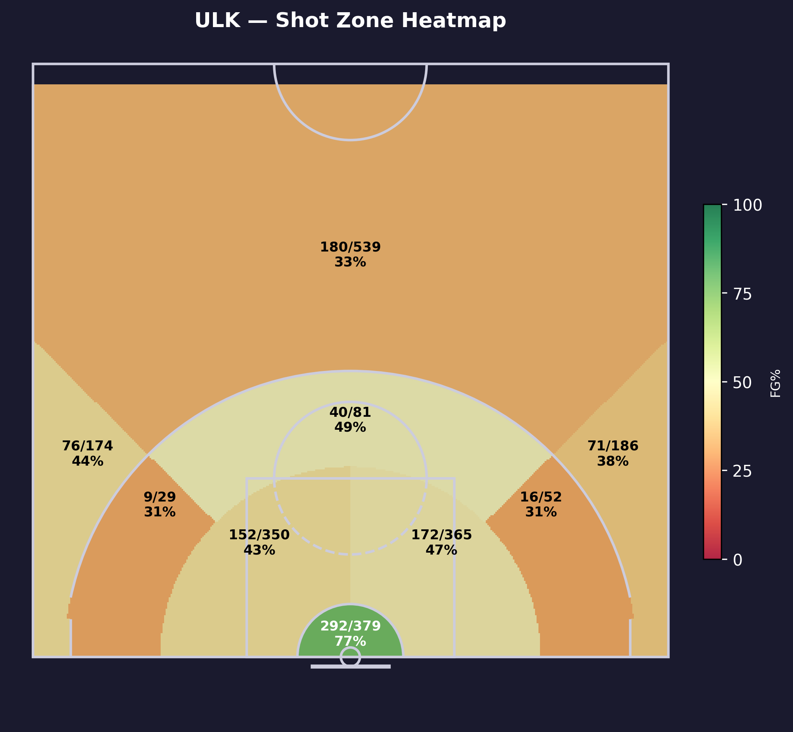
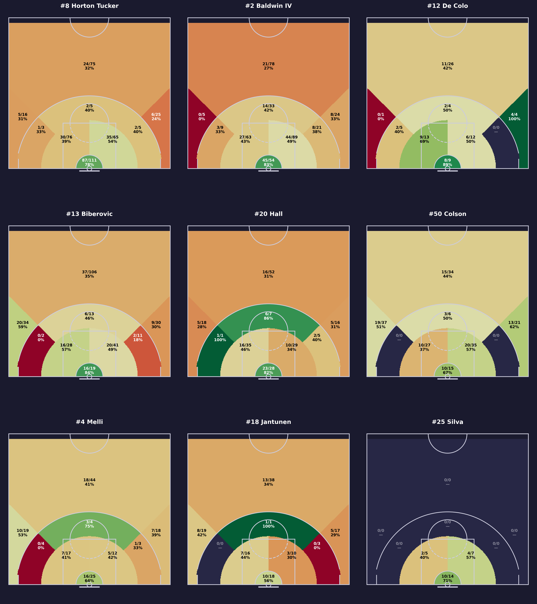
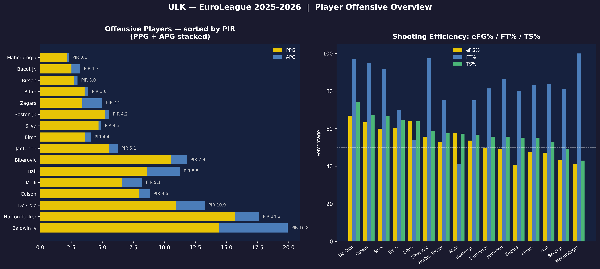
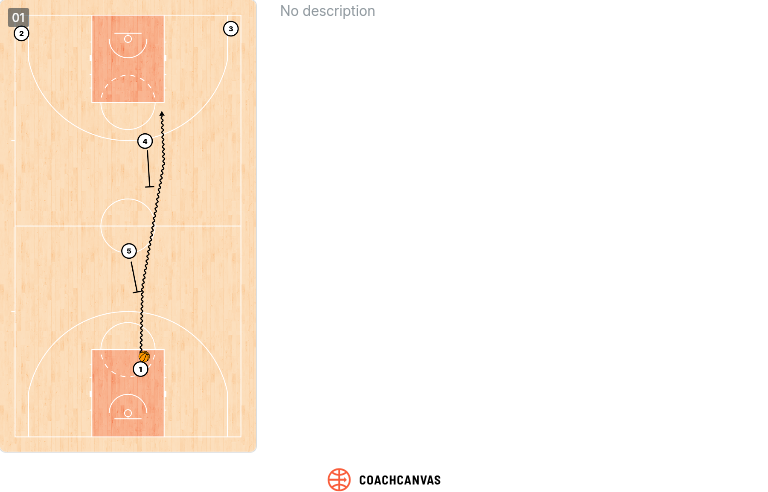

# C Offensive Analysis

## System Overview

**Offensive philosophy**

- Structured, execution-heavy offense under Šarūnas Jasikevičius
- Emphasis on fundamentals: shot selection, rebounding, low turnovers
- Mix of half-court creation and physical play rather than pure flow

**Pace**

- Generally controlled / medium pace
- Preference to dictate tempo rather than run

**Spacing principles**

- Functional spacing with multiple shooters
- Use of stretch bigs to open driving and passing lanes
- Strong offensive rebounding presence → accepts imperfect spacing to gain second chances

**Primary ball-handlers / creators**

- **Wade Baldwin IV** — main creator, PnR and isolation
- **Talen Horton-Tucker** — on-ball scorer, secondary creator, downhill driver
- **Devon Hall** — connector, secondary playmaking
- **Nando De Colo** — veteran decision-maker in half-court
- **Arturs Zagars** — backup guard, organizes second unit

---

## Shot Distribution by Zone

<!-- START_TABLE ZONE-DISTRIBUTION -->
| Zone              |   Attempts | % of Total   | FG%   |
|:------------------|-----------:|:-------------|:------|
| Centre 3PT        |        539 | 25.0%        | 33.4% |
| Under basket      |        379 | 17.6%        | 77.0% |
| Left short range  |        365 | 16.9%        | 47.1% |
| Right short range |        350 | 16.2%        | 43.4% |
| Left 3PT          |        186 | 8.6%         | 38.2% |
| Right 3PT         |        174 | 8.1%         | 43.7% |
| Centre mid-range  |         81 | 3.8%         | 49.4% |
| Left mid-range    |         52 | 2.4%         | 30.8% |
| Right mid-range   |         29 | 1.3%         | 31.0% |
<!-- END_TABLE ZONE-DISTRIBUTION -->

<!-- START_INFO ZONE-SUMMARY -->
!!! info "Zone Summary"
    Paint & Layup: **50.8%** of FGA (616/1094, FG% **56.3%**) — Mid-Range: **7.5%** of FGA (65/162, FG% **40.1%**) — 3-Point: **41.7%** of FGA (327/899, FG% **36.4%**)
<!-- END_INFO ZONE-SUMMARY -->

---

## Key Shooters
Top shooters by attempts-per-game for a given set of zones. In the `Primary zone` is shown the zone with the highest scoring percentage.
### 3 points Shooters
<!-- START_TABLE KEY-SHOOTERS -->
| Player               |   3PA/G | 3P%   | Primary Zone       |
|:---------------------|--------:|:------|:-------------------|
| BIBEROVIC, TARIK     |     5   | 38.8% | Right 3PT (58.8%)  |
| HORTON TUCKER, TALEN |     3.4 | 30.2% | Centre 3PT (32.0%) |
| HALL, DEVON          |     3.1 | 30.2% | Left 3PT (31.2%)   |
<!-- END_TABLE KEY-SHOOTERS -->

### Mid range Shooters
<!-- START_TABLE KEY-SHOOTERS-MIDRANGE -->
| Player           |   MidR PA/G | MidR FG%   | Primary Zone             |
|:-----------------|------------:|:-----------|:-------------------------|
| BALDWIN IV, WADE |         1.8 | 39.7%      | Centre mid-range (42.4%) |
| BIBEROVIC, TARIK |         0.8 | 30.8%      | Centre mid-range (46.2%) |
| DE COLO, NANDO   |         0.8 | 44.4%      | Centre mid-range (50.0%) |
<!-- END_TABLE KEY-SHOOTERS-MIDRANGE -->

### In the paint Shooters
<!-- START_TABLE KEY-SHOOTERS-PAINT -->
| Player               |   Paint PA/G | Paint FG%   | Primary Zone         |
|:---------------------|-------------:|:------------|:---------------------|
| HORTON TUCKER, TALEN |          7.4 | 60.3%       | Under basket (78.4%) |
| BALDWIN IV, WADE     |          5.9 | 56.3%       | Under basket (83.3%) |
| HALL, DEVON          |          3.3 | 53.3%       | Under basket (82.1%) |
<!-- END_TABLE KEY-SHOOTERS-PAINT -->

---
## Players Efficiency

## Primary Offensive Entries

Fenerbahce runs an extensive and highly structured playbook.
The common thread across nearly all sets is the pick-and-roll as the primary action or continuation, with most plays designed to either create a clean PnR read for Baldwin IV or isolate Horton-Tucker in 1-on-1 situations.
Jasikevičius also maintains a dedicated set of late-clock adjustments (Spain, Flare), reinforcing that this is a system built for execution and half-court control rather than improvisation.

### Entry 1 — Flat Double
Mianly played Horton-Tucker, sometimes by Baldwin IV

!!! danger "Defensive Priority"
    Force the ball handler to play with their weak hand, slow them down to prevent them reaching full screen and attacking the rim.

### Entry 2 — _Name / Label_

_Describe the play: ball movement, screens, options, and who typically finishes._

!!! danger "Defensive Priority"
    _How to stop this entry._

---

### Entry 3 — Spanish Pick & Roll

Spanish Pick and Roll between Horton-Tucker, Birch and Colson to free Colson for a uncontested 3PT shot (3PT FG >50%)

!!! danger "Defensive Priority"
    Don't switch on the first screen (Colson for Birch), defender on POA is aggressive on the ball to slow down the ball. 

## Pick & Roll Offense

**Overall PnR identity**:

- Structured, half-court heavy pick & roll system
- Uses PnR as a **read initiation tool**, often flowing into second-side actions
- Emphasis on spacing + advantage continuation rather than early-shot hunting

**Who sets screens**:

- **Khem Birch**: primary roll big (rim pressure, vertical finishing)
- **Nicolo Melli**: stretch 5/4 actions, pop + short roll playmaking
- **Mikael Jantunen**: versatile screener (pop, slip, or switch-compatible screens)

**Roll vs Pop tendencies**:

- **Roll-heavy** with Birch (rim runs, dunker spot occupation)
- **Pop/stretch heavy** with Melli and Jantunen to pull bigs away from paint
- Strong use of **short roll hub actions** (especially Melli as connector)

**Preferred side**:

- Uses **side PnR to force specific matchups**, not fixed but **handedness-driven advantage creation**
- Late-clock often shifts to **middle PnR to neutralize the defensive opponent scheme**

**Ball-handler decision-making**:

- **Wade Baldwin IV**: primary engine, aggressive scorer + kick-out passer
- **Talen Horton-Tucker**: downhill scorer, reads secondary help less than Baldwin
- **Devon Hall**: connector, stabilizes possessions, avoids over-dribbling
- **Nando De Colo**: late-clock manipulator, slower reads, high IQ advantage hunting

!!! tip "Tendencies"
    - Clear **handedness-driven side preference (Baldwin right / Horton-Tucker left)**
    - Heavy use of **PnR into second action (not first-option scoring)**
    - **Melli/Jantunen short roll decisions are central to offensive flow**