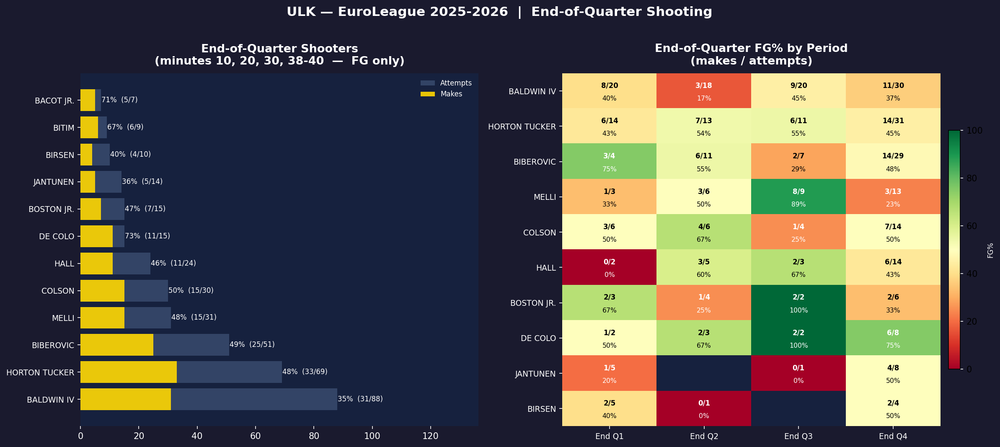
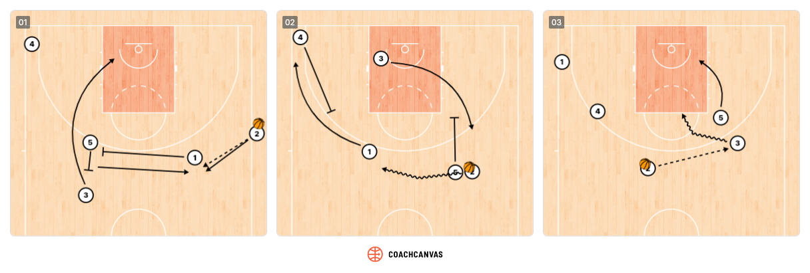

# F Special Situations / Clutch Time

## Clutch Time Performance (Last 4 Minutes)
To compute the following statistics, only games with a score difference < 10 points with 4 minutes to play were considered.
<!-- START_TABLE CLUTCH-STATS -->
| Metric                | Value                              |
|:----------------------|:-----------------------------------|
| Clutch games          | 22                                 |
| Record (W-L)          | 14 — 8                             |
| Clutch FG%            | 44.5%  (61/137)                    |
| Clutch 3P%            | 29.2%  (21/72)                     |
| Clutch Points / Game  | 10.2                               |
| Primary clutch scorer | Talen Horton Tucker (56 pts total) |
<!-- END_TABLE CLUTCH-STATS -->

!!! info "Clutch Identity"
    Horton Tucker is the primary clutch scorer (56 pts). Need defensive discipline + execution.  
    Horton Tucker and Baldwin often play iso situations.

---
## Last-Minute Shooters

## Last-Minute Play Tendencies

### With Lead (Last 2 Minutes)

_Describe how Fenerbahçe protects a lead: ball security, clock management, foul avoidance, defensive assignments._

!!! danger "Attack Their Lead Protection"
    _When down late, describe how to attack their tendency (e.g., trap the ball-handler, foul specific players)._

---

### Tied or Trailing (Last 2 Minutes)

When tied or trailing, Fenerbahce relies on their primary scorers: Horton-Tucker in 1-on-1 situations and Baldwin IV in ISO actions.
Defensively, they apply on-ball pressure and double the ball-handler to force turnovers. 

<!--
| Situation | Primary Option | Secondary Option | Key Screener |
|---|---|---|---|
| Down 1–3 pts | _Player_ | _Player_ | _Player_ |
| Down 4–6 pts | _Player_ | _Player_ | _Player_ |
| Tied | _Player_ | _Player_ | _Player_ |
-->
---

## Second Half Opening Plays

_Describe typical plays Fenerbahçe runs to open the second half or at the start of any quarter, based on observations from the last 5 games._

| Quarter | Play / Set | Primary Option |
|---|---|---|
| Q3 Open | _Play Name_ | _Player_ |
| Q4 Open | _Play Name_ | _Player_ |

---

## Out-of-Bounds Plays

### Baseline (BLOB)

_Describe their primary baseline out-of-bounds action: screen configuration, who receives, and finish options._

!!! danger "Coverage"
    _How to defend this BLOB._

---

### Sideline (SLOB)

Legend:   
1: Wade Baldwin Iv  
2: Devon Hall  
3: Tarik Biberovic  
4: Bonzie Colson   
5: Khem Birch  

_Describe their primary sideline out-of-bounds action._

!!! danger "Coverage"
    * 1st option: Defender on tarik Biberovic shouldn't allow the player to curl on the pin down  
    * 2nd option: Defender on Wade Baldwin Iv should stunt on the Biberovic drive  
