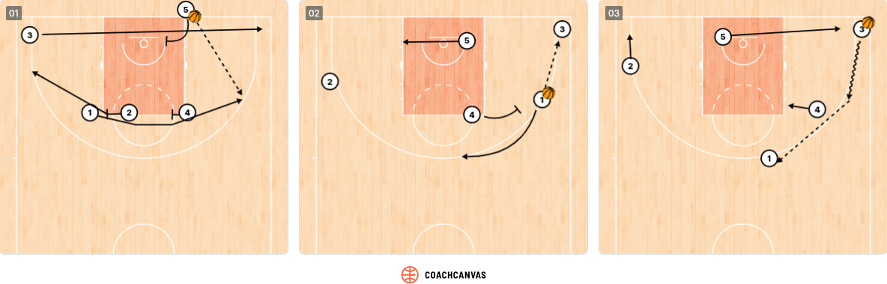

# F Special Situations / Clutch Time

## Clutch Time Performance (Last 4 Minutes)
To compute the following statistics, only games with a score difference < 10 points with 4 minutes to play were considered.
<!-- START_TABLE CLUTCH-STATS -->
| Metric                | Value                              |
|:----------------------|:-----------------------------------|
| Clutch games          | 22                                 |
| Record (W-L)          | 14 — 8                             |
| Clutch FG%            | 44.5%  (61/137)                    |
| Clutch 3P%            | 29.2%  (21/72)                     |
| Clutch Points / Game  | 10.2                               |
| Primary clutch scorer | Talen Horton Tucker (56 pts total) |
<!-- END_TABLE CLUTCH-STATS -->

!!! info "Clutch Identity"
    Horton Tucker is the primary clutch scorer (56 pts). Need defensive discipline + execution.  
    Horton Tucker and Baldwin often play iso situations.

---
## Last-Minute Shooters

## Last-Minute Play Tendencies

### With Lead (Last 2 Minutes)

When protecting a lead, Fenerbahçe relies on Baldwin IV to handle the ball and manage the clock, prioritizing possession security over shot creation.
They avoid putting the ball in the hands of poor free-throw shooters and switch to a more physical man-to-man defense, trusting Melli and Birch to protect the paint and limit second chances.

!!! danger "Attack Their Lead Protection"
    When down late, foul strategically — avoid Baldwin IV (solid FT shooter) and target **Birch** or **Bacot Jr.** on the offensive glass.
    Apply ball pressure on Baldwin to force clock mismanagement and consider trapping him in the corners to generate turnovers.
    Push pace on every dead ball to prevent Fenerbahçe from setting their defensive scheme.
---

### Tied or Trailing (Last 2 Minutes)

When tied or trailing, Fenerbahce relies on their primary scorers: Horton-Tucker in 1-on-1 situations and Baldwin IV in ISO actions.
Defensively, they apply on-ball pressure and double the ball-handler to force turnovers. 

<!--
| Situation | Primary Option | Secondary Option | Key Screener |
|---|---|---|---|
| Down 1–3 pts | _Player_ | _Player_ | _Player_ |
| Down 4–6 pts | _Player_ | _Player_ | _Player_ |
| Tied | _Player_ | _Player_ | _Player_ |

---

## Second Half Opening Plays

_Describe typical plays Fenerbahçe runs to open the second half or at the start of any quarter, based on observations from the last 5 games._

| Quarter | Play / Set | Primary Option |
|---|---|---|
| Q3 Open | _Play Name_ | _Player_ |
| Q4 Open | _Play Name_ | _Player_ |

---
-->
## Out-of-Bounds Plays

### Baseline (BLOB)
Stagger Flare

Legend:   
1: Bonzie Colson/ Tarik Biberovic   
2: Devon Hall  
3: Wade Baldwin Iv/ Arturs Zagars   
4: Khem Birch    
5: Nicolo Melli 

!!! danger "Coverage"
    _How to defend this BLOB._

---

### Sideline (SLOB)

Legend:   
1: Wade Baldwin Iv  
2: Devon Hall  
3: Tarik Biberovic  
4: Bonzie Colson   
5: Khem Birch  

!!! danger "Coverage"
    * 1st option: Defender on Tarik Biberovic shouldn't allow the player to curl on the pin down  
    * 2nd option: Defender on Wade Baldwin Iv should stunt on the Biberovic drive  
